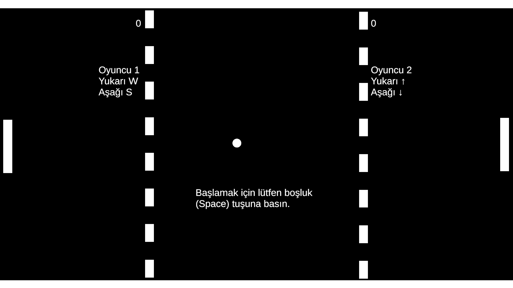
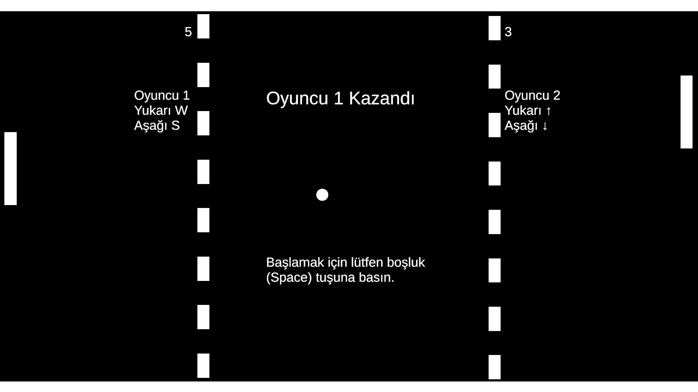

FlipShot
FlipShot, klasik Pong oyunundan esinlenerek geliştirilmiş iki kişilik bir oyundur. Oyuncuların hızlı reflekslerini test ederken, basit kontrollerle rekabetçi bir deneyim sunar. Oyuna Space (Boşluk) tuşuna basarak başlarsınız.

Kontroller
Oyuncu 1:
Yukarı: W
Aşağı: S

Oyuncu 2:
Yukarı: ok (↑)
Aşağı: ok (↓)

Başlat: Boşluk (Space)

Ekran Görüntüleri

Projenin test edilmesi için bağlantı => [FlipShot'u Oyna](https://metinmustafaaltintas.github.io/FlipShot_Oynanis/)